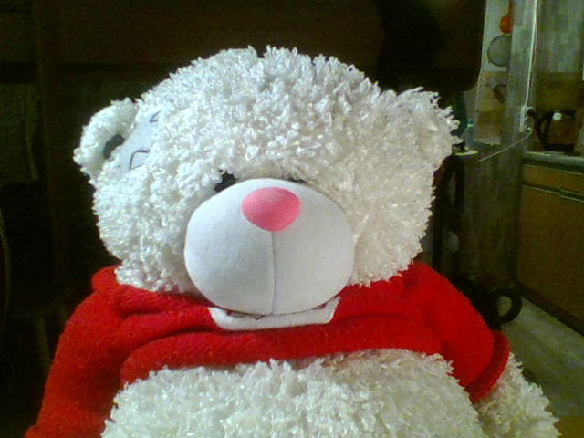
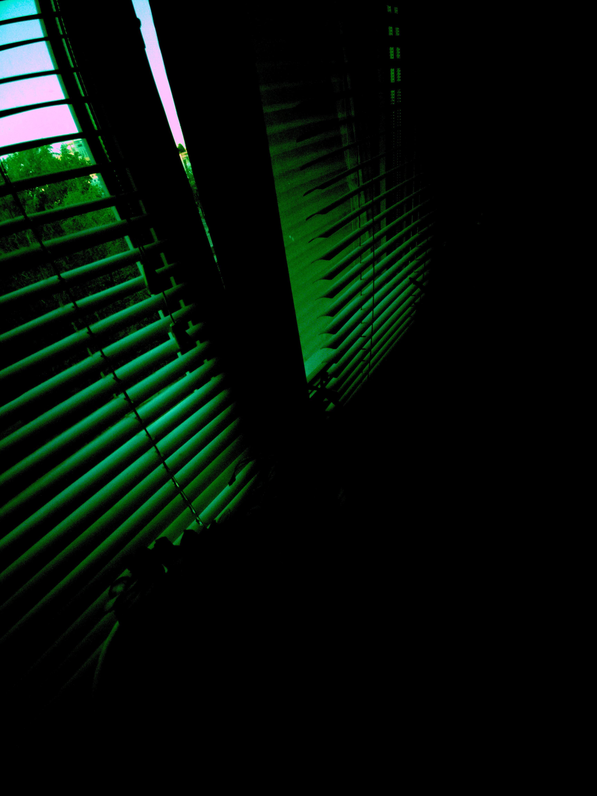
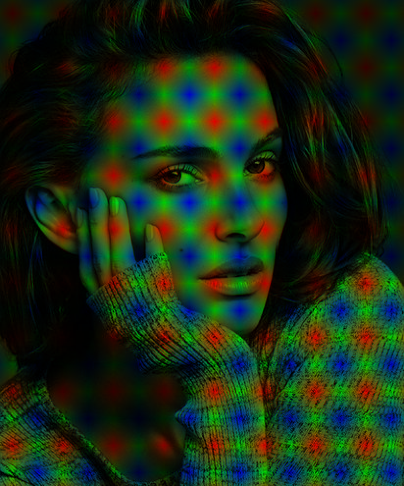
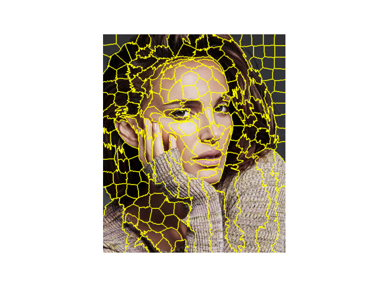

## Лабораторная работа 1. Получение изображений. Работа с RAW изображениями. Дебайеризация. Библиотеки работы с изображениями

1. Подготовка среды программирования
2. Поиск библиотек для работы с изображениями (OpenCV, Scikit-Image, Scipy, Python Image Library (Pillow/PIL), Matplotlib, SimpleITK, Numpy, Mahotas, Сolour)
3. Чтение изображений с камеры устройства

```
camera = cv2.VideoCapture(0, cv2.CAP_DSHOW)
winName = "image"
cv2.namedWindow(winName)
ret, frame = camera.read()
cv2.imshow(winName, frame)
cv2.imwrite("test.bmp", frame)
cv2.waitKey(0)

camera.release()
cv2.destroyAllWindows()
```

<div align="center">
 <div>Изображение:</div>
 
</div>

4. Получение RAW изображения с устройства.

```
raw = rawpy.imread('IMG_0001.dng')
rgb = raw.postprocess()
imageio.imsave('default.jpg', rgb)
```
 

<div align="center">
<div>Изображение:</div>
 
</div>

5. Создание алгоритма "байеризации".

```
from PIL import Image
import numpy

srcArray = numpy.array(Image.open("img.jpg"), dtype=numpy.uint8)
w, h, _ = srcArray.shape
resArray = numpy.zeros((2 * w, 2 * h, 3), dtype=numpy.uint8)
resArray[::2, ::2, 2] = srcArray[:, :, 2]
resArray[1::2, ::2, 1] = srcArray[:, :, 1]
resArray[::2, 1::2, 1] = srcArray[:, :, 1]
resArray[1::2, 1::2, 0] = srcArray[:, :, 0]

Image.fromarray(resArray, "RGB").save("o.png")

```

<div align="center">
<div>Результат:</div>
 
</div>

6. Выбор изображения для работы

7. Реализация суперпикселей. Аналоги библиотек.

```
numSegments = 300
image = img_as_float(io.imread("../2-bayer/img.jpg"))
segments = slic(image, n_segments=numSegments)
fig = plt.figure()
ax = fig.add_subplot(1, 1, 1)
ax.imshow(mark_boundaries(image, segments))
plt.axis("off")
plt.show()
```

 

8. Реализация билинейной интерполяции. Аналоги библиотек.

```
img = Image.open(path, 'r')

w, h = img.size
new_w = int(w * factor)
new_h = int(h * factor)

img.resize((new_w, new_h), Image.BILINEAR).save('./res.jpg')
```
<div align="center">
 <div>Результат:</div>
 
</div>

9. Реализация алгоритма VNG. Аналоги библиотек


