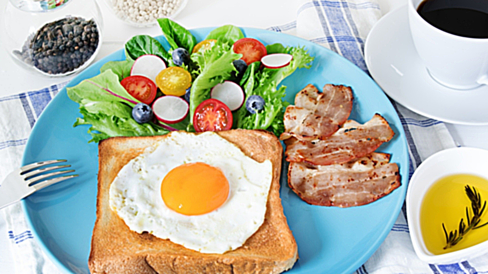
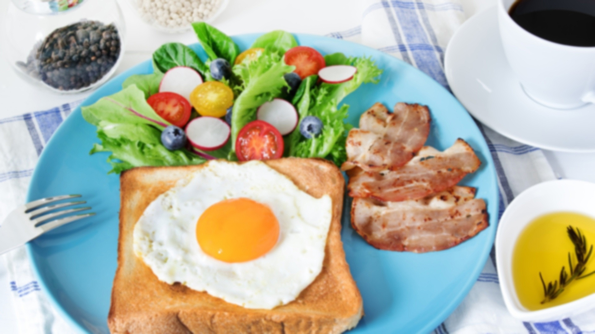

## Лабораторная работа 4. Повышение резкости изображений.

1. Скачать любое цифровое изображение. Желательно многоцветное

Исходное изображение: 


2. Применить к исходному изображению Гауссово размытие. Отобразить результат.

```
image = cv2.imread('../lab 2/img.jpg')
Gaussian = cv2.GaussianBlur(image, (5, 5), 2)
cv2.imwrite("out/blur.jpg", Gaussian)
```
Здесь __GaussianBlur__( кадр, размер ядра, отклонение ) - метод библиотеки OpenCV, где
- кадр - источник (входное изображение) 
- размер ядра — список из двух чисел (x,y), которые задают размер ядра фильтра Гаусса по горизонтали и вертикали. Чем больше ядро, тем более размытым станет кадр;
- отклонение — стандартное отклонение по оси X.


3. Реализовать функцию повышения резкости методом усиления границ.

Можно увеличить резкость изображения с помощью алгоритма Unsharp masking (нерезкой маски), 
которая усиливает края с помощью процедуры, вычитающей сглаженную (нерезкую) версию 
изображения из исходного изображения:

```
def sharp(image, kernel_size=(9, 9), sigma=1.0, amount=5.0, threshold=0):
    blurred = cv2.GaussianBlur(image, kernel_size, sigma)
    sharpened = float(amount + 1) * image - float(amount) * blurred
    sharpened = np.maximum(sharpened, np.zeros(sharpened.shape))
    sharpened = np.minimum(sharpened, 255 * np.ones(sharpened.shape))
    sharpened = sharpened.round().astype(np.uint8)
    if threshold > 0:
        low_contrast_mask = np.absolute(image - blurred) < threshold
        np.copyto(sharpened, image, where=low_contrast_mask)
    return sharpened
```

- amount контролирует величину каждого выброса (насколько темнее и насколько светлее становятся границы краев). Это также можно рассматривать как добавление контраста по краям.
- threshold - порог для низкоконтрастной маски.

4. Применить построенную функцию к размытому изображению. Вывести результат работы функции вместе с исходным изображением.



5. Используя две любые функции повышающие резкость изображения, обработать размытое изображение. Результаты также вывести вместе с исходным изображением для сравнения.

 - Метод ImageEnhance.Sharpness() библиотеки PIL – можно использовать для настройки резкости изображения.
 Коэффициент (factor) усиления 0 дает размытое изображение, коэффициент 1 дает исходное изображение,
 а коэффициент 2 и более дает четкое изображение.
```
image = Image.open("out/blur.jpg")
factor = 5
enhancer_object = ImageEnhance.Sharpness(image)
out = enhancer_object.enhance(factor)
out.save("out/sharpness.jpg")
```
Исходное размытое изображение: 

Результат:


- Для повышения резкости можно также использовать соответствующее ядро,представляющее собой небольшую матрицу, и функцию filter2D.
```
image = cv2.imread('out/blur.jpg')
kernel = np.array([[0, -1, 0], [-1, 5, -1], [0, -1, 0]])
im = cv2.filter2D(image, -1, kernel)
cv2.imwrite("out/sharpness2.jpg", im)
```
Исходное размытое изображение: 

Результат:
