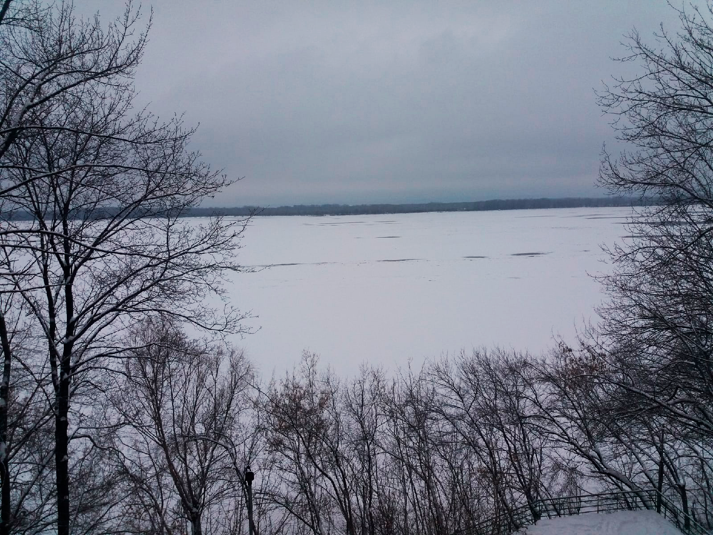
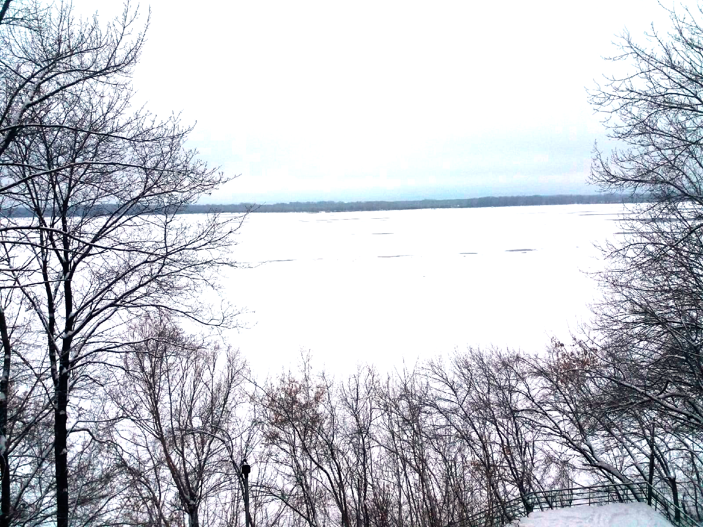
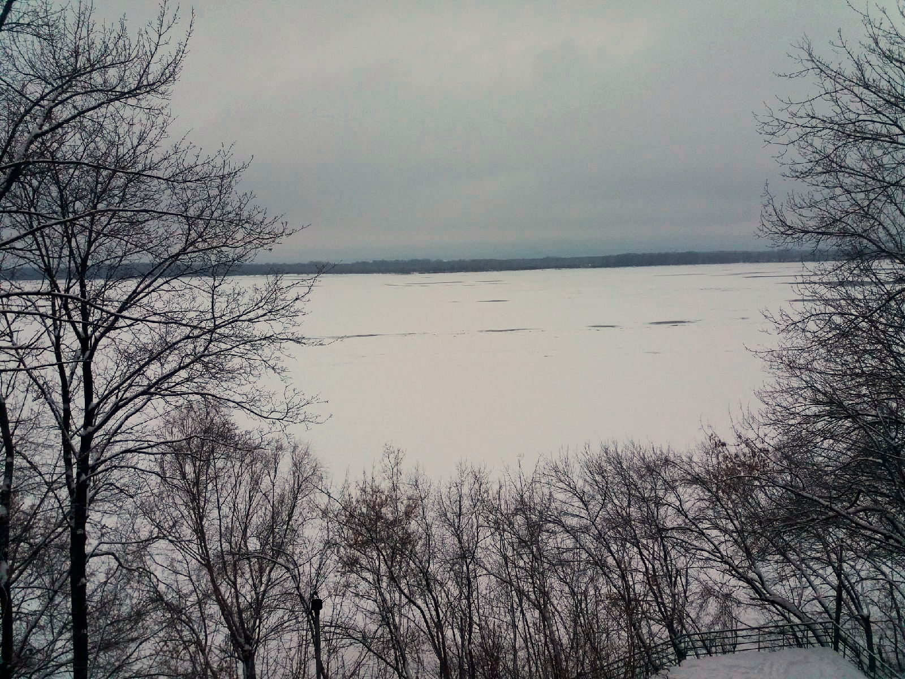
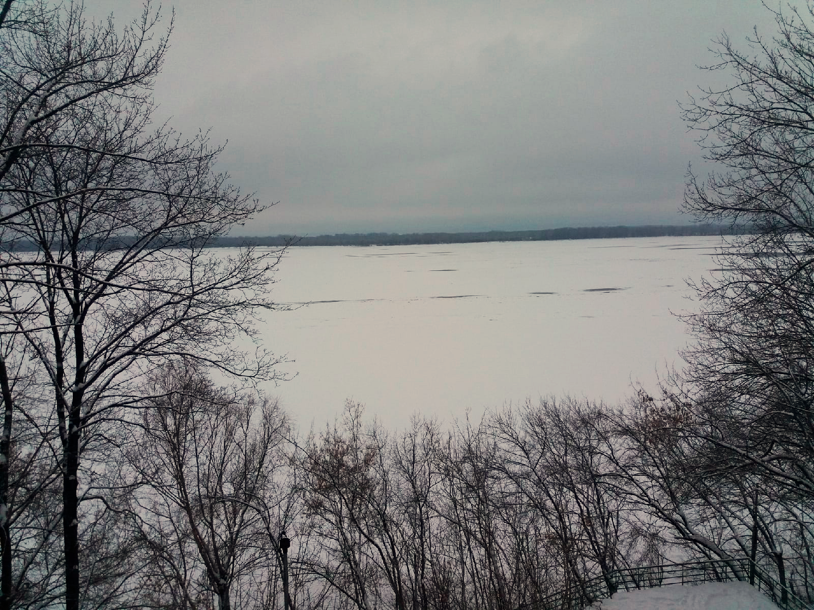
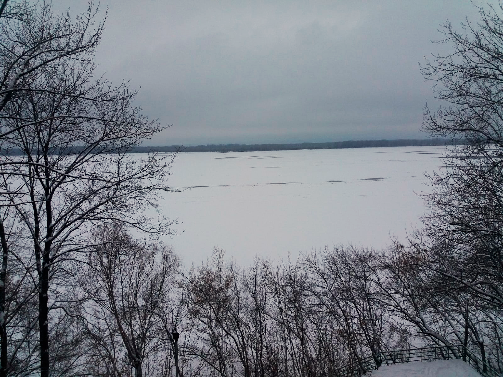

## Лабораторная работа 5. Баланс белого.

1. Скачать цветное изображение по выбору с нарушенным цветовым балансом (желательно, чтобы на изображении был объект
   предположительно белого цвета).

<div align="center">
 
</div>

2. Определить вручную цвет объекта, построить преобразование (матрицу 3х3) для коррекции белого. Применить к
   изображению. Не забудьте про нормировку яркости (если она будет нужна).

Заранее была произведена корректировка яркости изображения в Photoshop и определены значения цвета белой поверхности (
снега) на изображении с помощью пипетки.

```
Rw = 143
Gw = 143
Bw = 153

diag_matrix = np.array([[255 / Rw, 0, 0],
                        [0, 255 / Gw, 0],
                        [0, 0, 255 / Bw]])


def correct_color(image):
    b, g, r = cv2.split(image)
    balance_r = diag_matrix[0][0] * r + diag_matrix[0][1] * g + diag_matrix[0][2] * b
    balance_g = diag_matrix[1][0] * r + diag_matrix[1][1] * g + diag_matrix[1][2] * b
    balance_b = diag_matrix[2][0] * r + diag_matrix[2][1] * g + diag_matrix[2][2] * b
    return dstack((balance_r, balance_g, balance_b))


orig_image = cv2.imread("../image.png")
balance_image = correct_color(orig_image)
cv2.imwrite("../out/balance_image.png", balance_image)
```

<div align="center">
 
</div>

3. Исходное изображение скорректировать согласно теории Серого мира вручную.

```
def grey_world_balance(img):
    b, g, r = cv2.split(img)
    B_ave, G_ave, R_ave = np.mean(b), np.mean(g), np.mean(r)
    Avg = (B_ave + G_ave + R_ave) / 3
    rw = r * Avg / R_ave
    gw = g * Avg / G_ave
    bw = b * Avg / B_ave
    for i in range(len(bw)):
        for j in range(len(bw[0])):
            bw[i][j] = 255 if bw[i][j] > 255 else bw[i][j]
            gw[i][j] = 255 if gw[i][j] > 255 else gw[i][j]
            rw[i][j] = 255 if rw[i][j] > 255 else rw[i][j]

    corrected_img = np.uint8(np.zeros_like(img))
    corrected_img[:, :, 0] = bw
    corrected_img[:, :, 1] = gw
    corrected_img[:, :, 2] = rw
    return corrected_img
```

<div align="center">
 
</div>

4. Исходное изображение скорректировать согласно теории Серого мира при помощи библиотечной функции. Была выбрана
   библиотека colorcorrect для обработки изображения

```
import colorcorrect.algorithm as cca

orig_image = cv2.imread("../image.png")
cv2.imwrite("../out/grey_world_balance_lib_image.png", cca.grey_world(orig_image))
```

<div align="center">
 
</div>

5. Опционально: найти библиотечную реализацию метода Ретинекс и применить подход к исходному изображению.

```
import colorcorrect.algorithm as cca
import cv2

orig_image = cv2.imread("../image.png")
cv2.imwrite("../out/retinex_lib_image.png", cca.retinex(orig_image))
```

<div align="center">
 
</div>

6. Все результаты вывести на экран рядом для визуального сравнения.

<div align="center">
  
  
  
  
  
</div>
